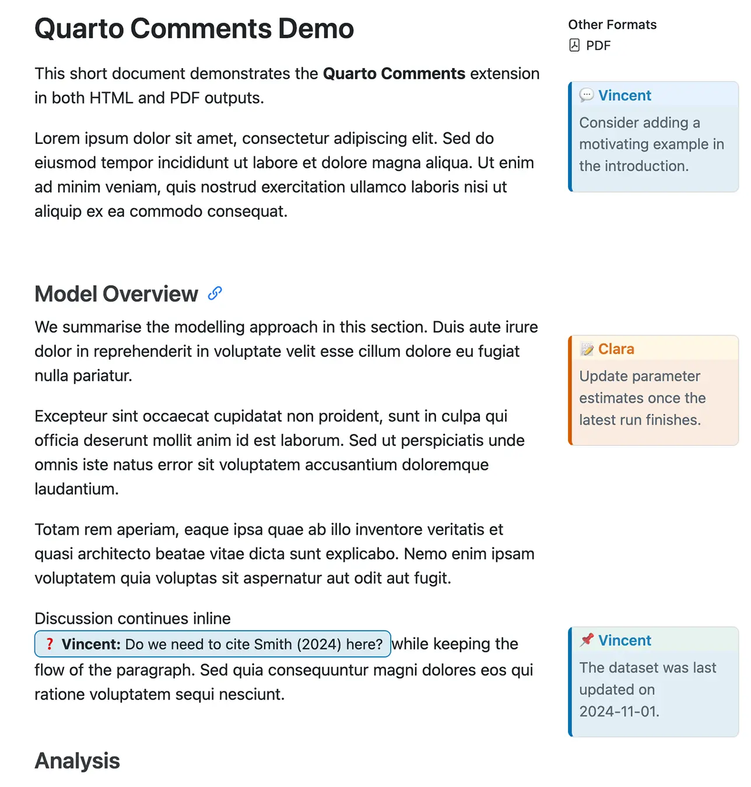
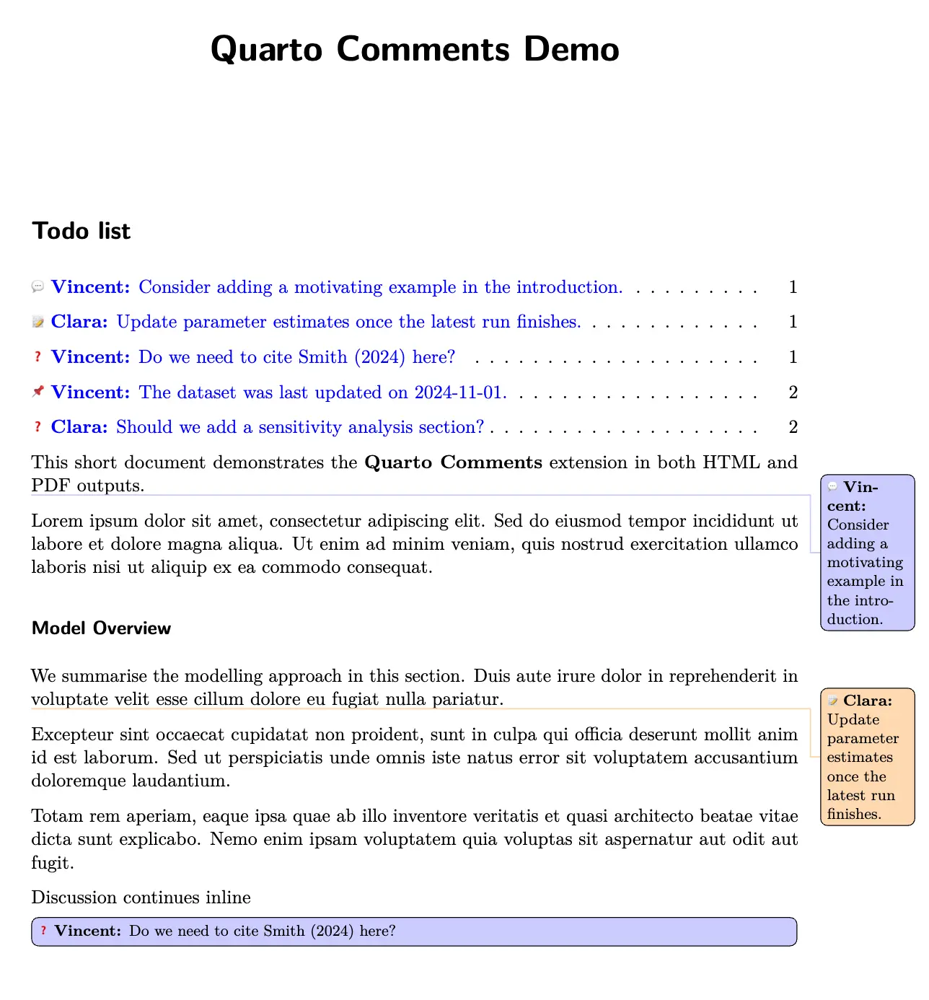

# Quarto Comments Extension

The **Quarto Comments** extension adds collaboration-friendly annotations to Quarto documents. Authors can insert inline notes, to-dos, and discussion points that render as margin callouts in HTML outputs and as [`todonotes`](https://ctan.org/pkg/todonotes) in PDF/LaTeX builds. Comments can be toggled globally and customised per author or reviewer.

## Installation

```bash
quarto add vgreg/quarto-comments
```

Then enable the extension for your project:

```yaml
project:
  extensions:
    - comments
```

IMPORTANT: You are not done yet! See the **Configuration** section below for additional setup steps required for PDF output.

## Screenshot

Here are sample renderings of the same document with comments in both HTML and PDF formats:





## Shortcodes

Use the `comment` shortcode or one of its aliases directly inside your document:

```markdown




```

### Arguments

| Argument    | Type                          | Description                                           |
|-------------|-------------------------------|-------------------------------------------------------|
| positional  | string                        | Required comment text                                 |
| `author`    | string                        | Matches a key defined in the configuration            |
| `type`      | comment \| todo \| note \| question | Controls styling for iconography and colours     |
| `inline`    | boolean                       | Forces inline rendering instead of a margin callout   |

All aliases (`todo`, `note`, `question`) map to the same underlying logic and set the default `type`.

## Configuration

Project-level options live under the `comments` key. They can override extension defaults:

```yaml
---
title: "My Document"
validate-yaml: false  # Required for Quarto 1.8+ to accept custom comments key
format:
  html: default
  pdf:
    include-in-header:  # Required for PDF output
      text: |
        \usepackage{xcolor}
        \usepackage{todonotes}
        \usepackage{emoji}
    include-before-body:  # Optional: add list of comments at document start
      text: |
        \listoftodos
comments:
  enabled: true      # toggle comments globally
  show_author: true  # hide author labels when false
  authors:
    vg:
      name: "Vincent"
      color_html: "#0072B2"        # Hex color for HTML
      color_latex: "blue!20"       # xcolor spec for LaTeX
    cg:
      name: "Clara"
      color_html: "#D55E00"        # Hex color for HTML
      color_latex: "orange!30"     # xcolor spec for LaTeX
---
```

### Required Settings

**YAML Validation**: Quarto 1.8+ enforces strict YAML validation. Add `validate-yaml: false` to your document frontmatter to allow the custom `comments` configuration key.

**PDF/LaTeX Setup**: For PDF output, you must manually include the required LaTeX packages in your document's `include-in-header` section (shown above). Due to Quarto extension limitations, these packages cannot be injected automatically by the extension.

### Optional Settings

- When `enabled: false`, all comment shortcodes are stripped from the output.
- Authors without defined colours fall back to sensible defaults per comment type.
- Anonymous comments (no `author`) automatically suppress author labels.

## Output Behaviour

### HTML

- Margin callouts styled as standard Quarto callouts, colourised per author or comment type.
- Inline comments render as compact badges that sit within text runs.
- Custom CSS is bundled (`_extensions/comments/assets/comments.css`) and injected automatically.

### PDF / LaTeX

- Comments render via the [`todonotes`](https://ctan.org/pkg/todonotes) package; inline comments use `\todo[inline]{...}`.
- Requires manual setup of `\usepackage{xcolor}`, `\usepackage{todonotes}`, and `\usepackage{emoji}` in your document's `include-in-header` section (see Configuration above).
- Author-specific colours are defined dynamically. Hex colours are converted to `\definecolor`.
- Base layout hints (margin width, default todo styling) live in `_extensions/comments/assets/comments.sty`.
- **List of Comments**: To generate a clickable table of contents-style list of all margin comments at the beginning of your PDF document, add `\listoftodos` to your `include-before-body` section (see example in Configuration above). Inline comments are excluded from the list.

### Other Formats

Formats without specialised handling fall back to a simple textual representation such as:

```
TODO (vg): Need to expand this section.
```

## Minimal Example

A runnable example document is included at `example.qmd`. From the repository root you can render it to both HTML and PDF:

```bash
quarto render example.qmd --to html,pdf
```

The example demonstrates author configuration, margin callouts, and inline comments. Use it as a starting point when wiring the extension into your own projects.
